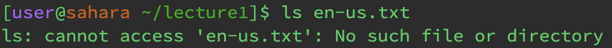

For my first use of ls which contained no arguments, the working directory would be ~ or /home. The reason I had gotten this output is because ls calls for a list of the current directory contents. Since there are no arguments, this means all shell arguments are printed so it will print out just the lecture1 directory instead of providing a current directory. This output is expected. 

FOr my second use of ls which was used with a path to a directory as an argument, the working directory would still be /home. The reason I got this output is because it printed the contents of the current directory list inside of the lecture1 directory. This output is as expected. 

For my third use of ls which was used with a path to a file as an argument, 

