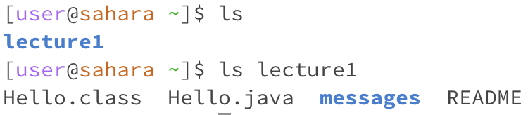
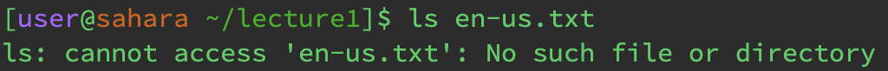
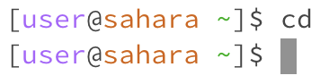
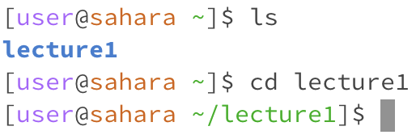
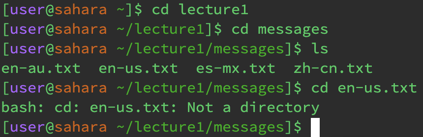
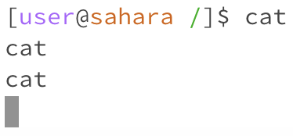
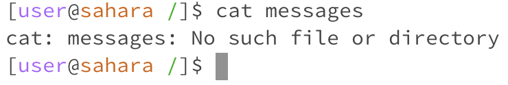
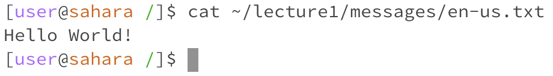

# Lab Report 1

For my first use of ls which contained no arguments, the working directory would be ~ or /home. The reason I had gotten this output is because ls calls for a list of the current directory contents. Since there are no arguments, this means all shell arguments are printed so it will print out just the lecture1 directory instead of providing a current directory. This output is expected. 

For my second use of ls which was used with a path to a directory as an argument, the working directory would still be /home. The reason I got this output is because it printed the contents of the current directory list inside of the lecture1 directory. This output is as expected. 

For my third use of ls which was used with a path to a file as an argument, the working directory would now be /home/lecture1. For my output I had received an error as there was no file in the directory. This makes sense as I had first printed the contents inside of lecture1, then I had printed the list of contents inside of the messages folder. When I tried to list the contents of the en-us.txt file though, it would come out as an error as there would be no files inside of the en-us.txt file. This output was an expected error output. 

For my first use of cd which contained no arguments, the working directory would be /home. For my output, cd outputted whatever the current directory is instead of changing the directory like it is supposed to do. This is because it has no arguments so there is no directory to change to. This output is as expected. 

For my second use of cd which was used with a path to a directory as an argument, the working directory would be under /home/lecture1. For my output, cd changed the directory of the home directory to the lecture1 folder. If ls is printed then this would list all the contents of the lecture1 folder on the screen. This output is expected. 

For my third use of cd which was used with a path to a file as an argument, the working directory would be under /home/lecture1/messages. For my output, cd changed the directory of the lecture1 folder to the messages folder, and then from there changed the directory of the messages folder to the en-us.txt file. This output was expected as en-us.txt is not in the directory since it is a file. Cd is only looking for directories as arguments. 

For my first use of cat which contained no arguments, the working directory is /home. For my output, cat outputs the contents of any file and since there are no files inside of the home directory, it will just print out whatever is typed into the terminal. This output was expected as there are no files in the directory. 

For my second use of cat which was used with a path to a directory as an argument, the working directory would be under /home. It would also produce an error and this is because the question is calling for a path to a directory, but cat only prints the contents of a file. This output is expected as it cannot work on a directory. 

For my third use of cat which was used with a path to a file as an argument, the working directory would be under /home/lecture1/messages/en-us.txt. It would produce the file contents within the en-us.txt file which is 'Hello World!', this is because the cat can only print the contents of a file. This output was expected. 

