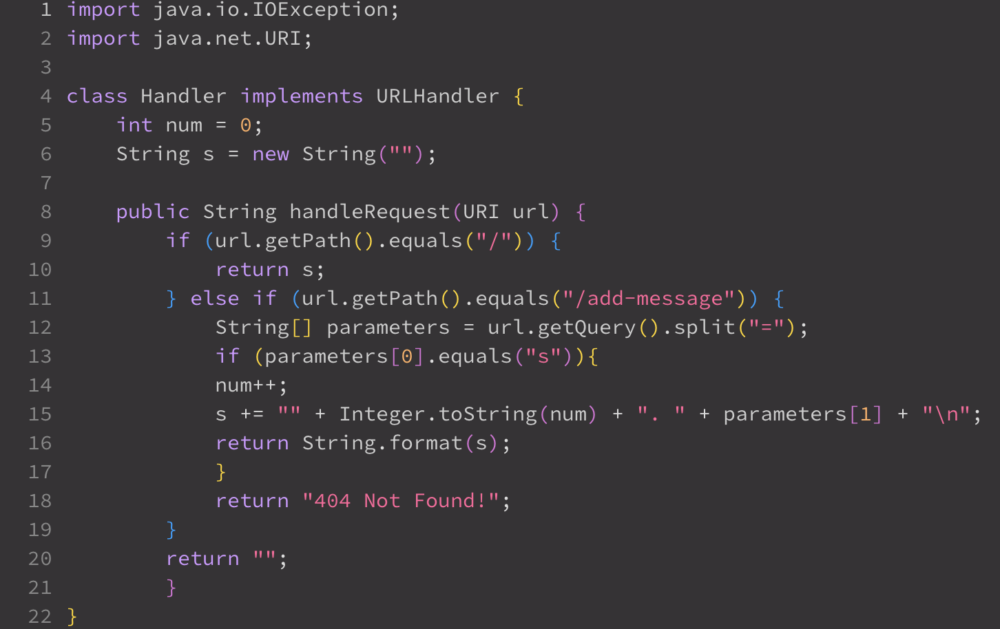
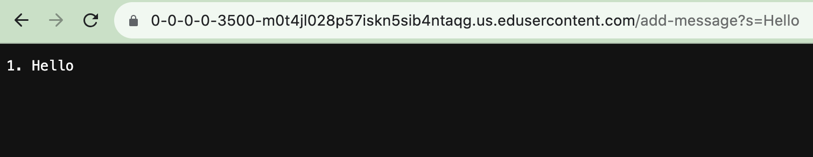
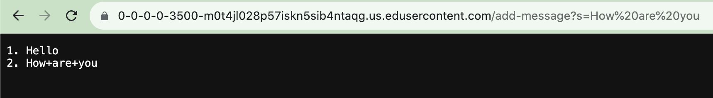

# Lab Report 2
This is the code for the StringServer web server... 

Here are screenshots of two instances where I had used the /add-message...

PART 2:
The bug I had chosen from the list given to me was under the Array examples where I needed to successfully reverse an array with all the elements in that order. 
My first step was to create a failure inducing input for the buggy program, as a JUnit test. 

''''

    import static org.junit.Assert.assertArrayEquals;
    import org.junit.Test;

    public class reverseFail {

    @Test
    public void testReverseFail() {
        int[] input = {1, 2, 3, 4, 5};
        int[] expected = {5, 4, 3, 2, 1};
        int[] reversedArray = ReversedArray.reversed(input);
        assertArrayEquals(expected, reversedArray);
    }
}
''''
My second step was to create a JUnit test that doesn't induce a failing output. 
# code block
    import static org.junit.Assert.assertArrayEquals;
    import org.junit.Test;

    public class reversePass {

    @Test
    public void testReversePass() {
        int[] input = {5, 4, 3, 2, 1};
        int[] expected = {1, 2, 3, 4, 5};
        int[] reversedArray = ReversedArray.reversed(input);
        assertArrayEquals(expected, reversedArray);
    }
}

The before and after code for this bug would look like this...

Before:
# code block 
    static int[] reversed(int[] arr) {
        int[] newArray = new int[arr.length];
        for(int i = 0; i < arr.length; i += 1) {
          arr[i] = newArray[arr.length - i - 1];
        }
        return arr;
      }
  
  After:
  # code block 
    static int[] reversed(int[] arr) {
        int[] newArray = new int[arr.length];
        for (int i = 0; i < arr.length; i++) {
            newArray[i] = arr[arr.length - i - 1];
        }
        return newArray;
    }
    
This fix would have solved the issue that the previous program contained because I created a new array to store the values of the reversed integers. This was to ensure that the 'arr' variable wouldn't be modified and the new array can be placed in the 'newArray'. 
