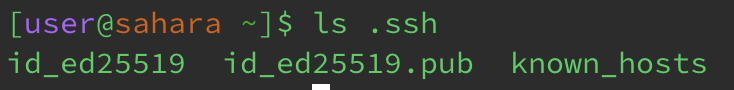
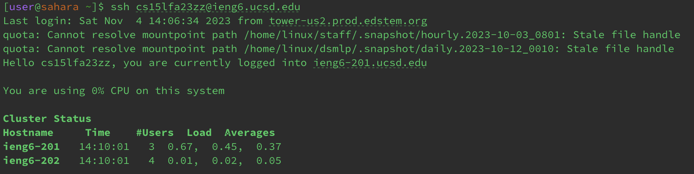

# Lab Report 2
**PART 1:**

This is the code for the StringServer web server... 

Here are screenshots of two instances where I had used the /add-message...

For my code, the method that was called was the String handleRequest(URI url) which would come from the Handler class and handles the HTTP requests. The relevant argument to the method would be the "URI url" as it is a parameter that is supposed to be representative of the incoming HTTP requests, and the relevant field in my StringServer class would be the num and s. The num is representative of being a counter and the s is a string. The num and s would be changed based on specific requests through user input, for example when the address has an "/add-message" as well as contains an "s" parameter, then this would mean that the "num" gets incremented and the "s" is updated with the incremented number as well as the string after the "s=".

**PART 2:**

Here is the path to my private key on my home computer, the private key is stored in *id_ed25519*:

Here is the path to my public key on *ieng6*:

Here is a screenshot of logging into *ieng6* without a password: 

**PART 3:**

I had learned alot from these past 2 weeks of lab, but I think the one thing that really stood out to me was being able to create the web server. It was interesting being able to develop and test a URL and to be able to tweak it to output certain things on the screen. This could range from incrementing a number to displaying text. 
