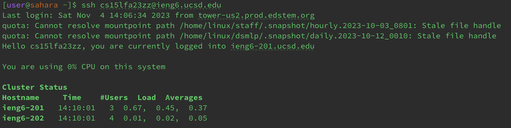
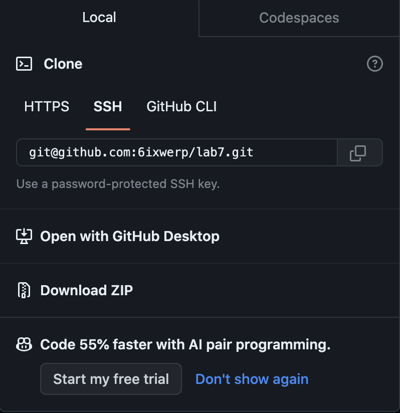
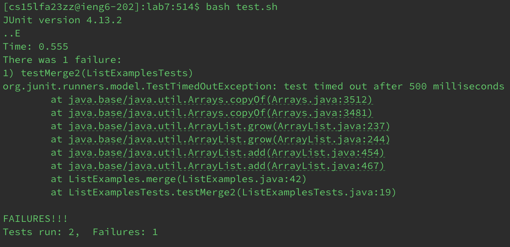
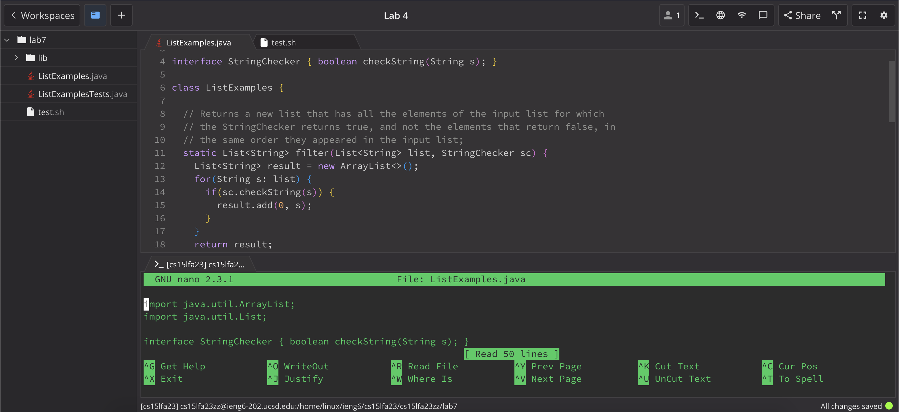
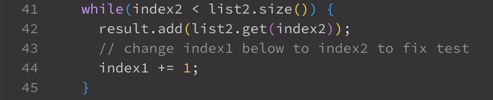
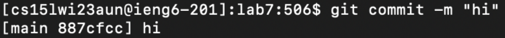
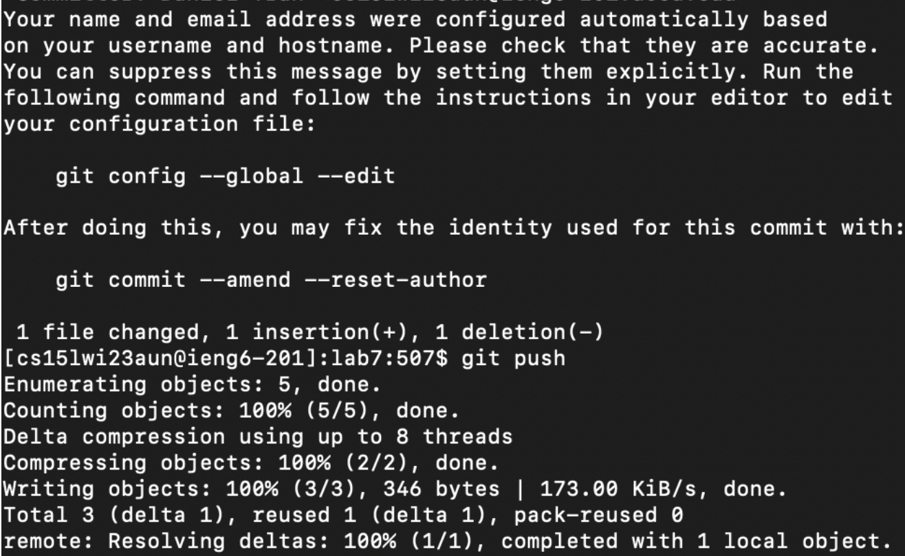

**Step 1: Sign into ieng6**

I logged into my ieng6 account and typed `ssh cs15lfa23zz@ieng6.ucsd.edu` `<enter>` which then logged me into the remote server.

**Step 2: Fork and clone repository**

In order to fork and clone the repository on GitHub you would need to follow this [Link](https://github.com/ucsd-cse15l-w23/lab7) and then select the `Fork` button that looks like this: 
press it, and to clone this repository you need to press the code button and then go to SSH: 
copy the code that was given to you and paste it into your github terminal. I went to my terminal and typed `git clone git@github.com:6ixwerp/lab7.git` then pressed `<enter>` and it will look like this:  (I had already cloned the lab earlier)

**Step 3: Running the JUnit tests**

Now we are going to run the JUnit tests, in order to do this we are going to type `ls` `<enter>` and then `cd lab7` `<enter>`. Now we are going to type `bash test.sh` `<enter>`, which will tell you if you had passed the tests or not, in this case we should not: 

**Step 4: Editing the java code**

Since it showed that the JUnit tests failed we need to edit the code in order to make it run successfully. Look for the bug and edit it accordingly. You will need to type `nano` *ListExamples.java* and you should see this in the terminal: 
then in order to look for the bug you will need to press `Ctrl + W index2` to jump to the bug on line 44: 
then edit the code and press `Ctrl + O` to save and `Ctrl + X` `<enter>` to exit. 

**Step 5: Run the JUnit tests with fix**

You can run the Junit tests using the terminal history by pressing `<up>` on your key pad until you reach the commands used for initially running the bash script: 

**Step 6: Commit and push to Github**

Now you can push the resulting change into your Github account by typing `git add ListExamples.java` `<enter>`, then typing `git command -m "string"` `<enter>`, and finally type `git push` `<enter>` and this would commit and push all edits successfully into your Github!

