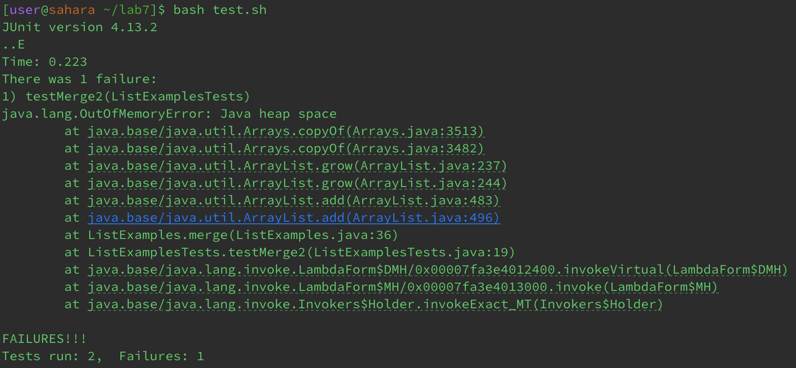
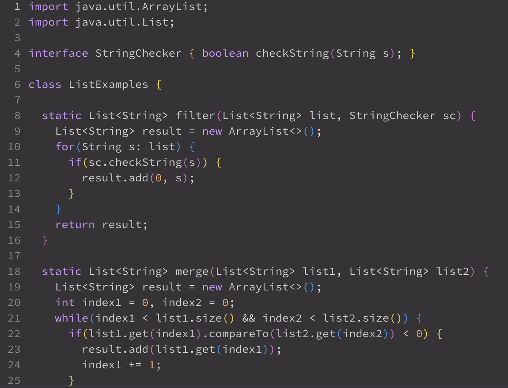
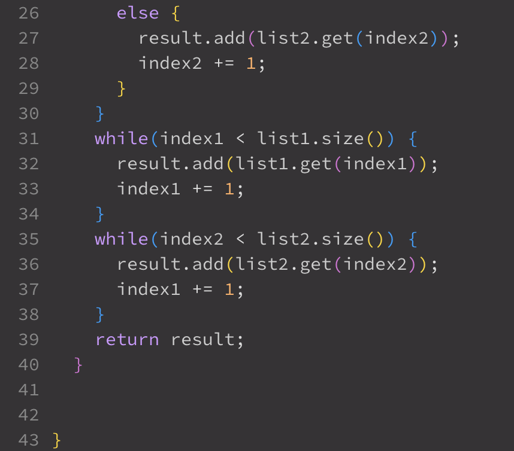
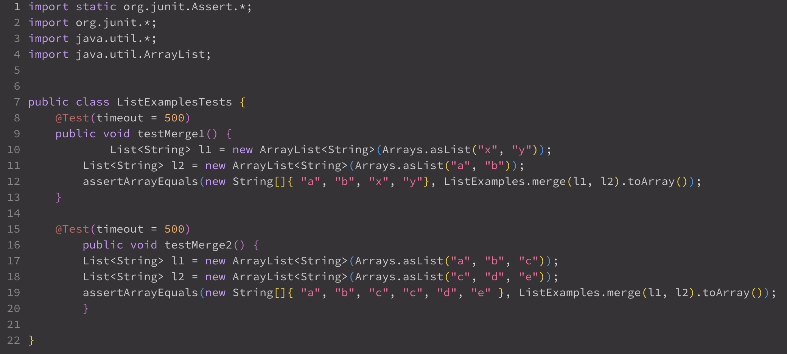
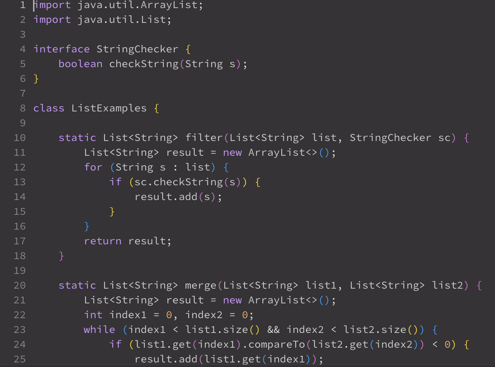
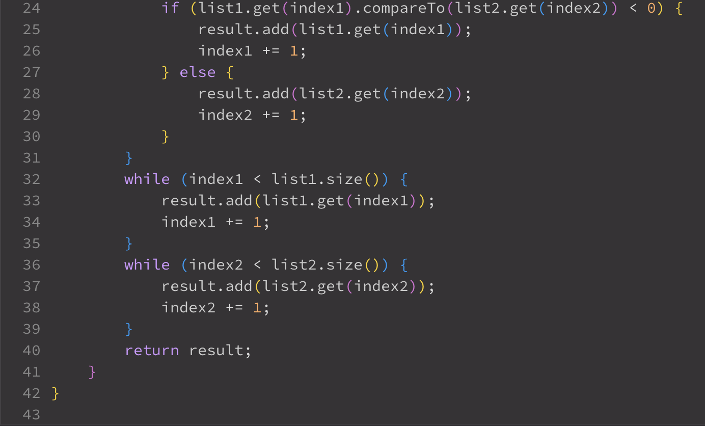
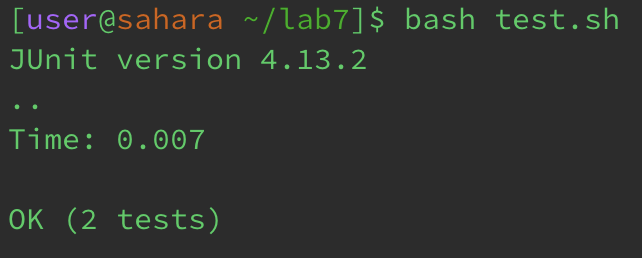

# PART 1

Student: Hello! I'm working on my `ListExamples.java` file and tried running it using `bash test.sh`. However, I'm encountering an issue. I have attached a screenshot of the symptom. It seems like the program is not handling the user input correctly. I suspect there might be a bug in my code related to reading input. I am guessing that it has something to do with my `add(0, s)` in the `filter` method. 


Here's a snippet of my Java code:



I also will attach my `ListExamplesTests.java` class just in case:



TA: Hello, you are on the right track seeing that your `add(0, s)` is causing you problems. However, that isn't the only thing that is causing problems in your `ListExamples.java` class. Check your `merge` method, is there anything that can be the potential cause for an out of bounds error?

Student: Ok! I think I know what you are implying, I fixed the code and it appears to be running correctly now. I noticed that I needed to change my `index1` to an `index2`. As for my `filter` method, I realized that it would be easier to get rid of the `add(0, s)` and just add the string directly to the result list. 




**File/Directory Structure**
```
-lab7
 -.gitignore
 -lib
  -hamcrest-core-1.3.jar
  -junit-4.13.2.jar
 -ListExamples.java
 -ListExamplesTests.java
 -test.sh
```

 The command line I had used to trigger the bug and run the passed test was `bash test.sh`, and the before and after code was posted earlier in the lab. In order to fix the code I had replaced the `index1` with an `index2` in the `merge` method as well as replaced the `result.add(0, s)` with `result.add(s)` in the `filter` method. 

# PART 2

I learned many things in this lab over the course of the quarter but I would say that the main thing that stood out to me was learning about vim. 
Although I was having trouble with it initially, as I watched the tutorial though I got a better grasp of how to navigate through it and it made 
editing documents and other things so much easier to do. Another cool thing I learned was the functions used in linux such as grep, which make it 
easier to do pretty much anything within your files. 
